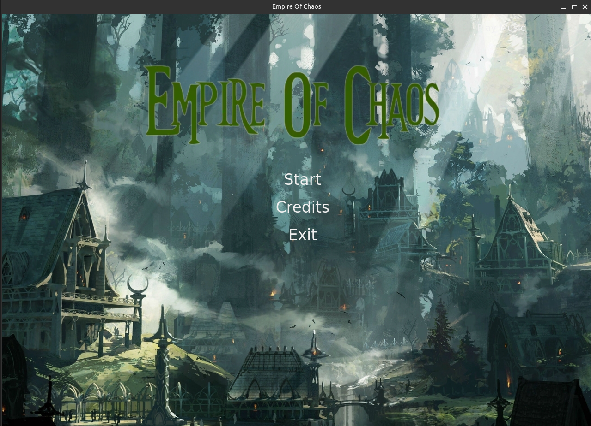
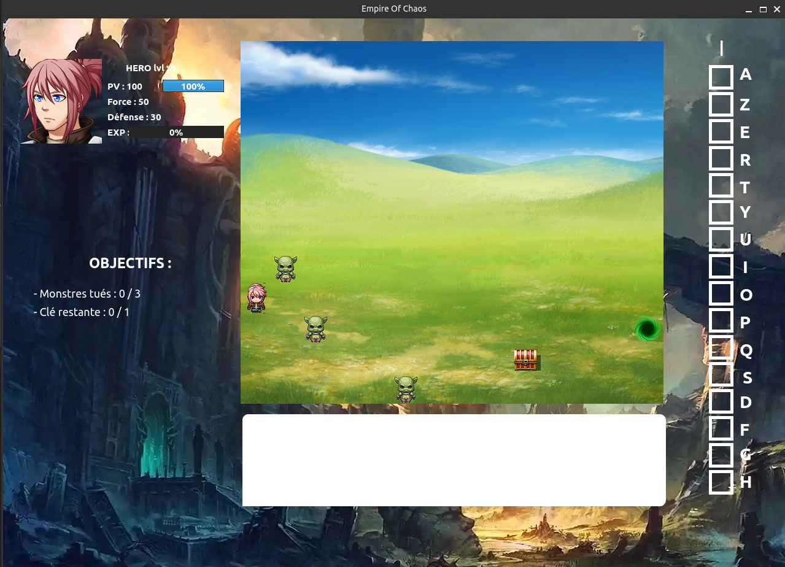

# Empire-Of-Chaos

 

Empire of Chaos est un RPG où vous incarnez un héros chargé de sauver le monde de la destruction.

## Commandes

- Flèches du clavier : se déplacer
- Entrée: attaquer / interagir
- Les raccourcis clavier: spécifier sur l'inventaire, pour utiliser un objet.

## Fonctionnalités actuelles

- Système de leveling
- Utiliser des d'objets
- Attaquer des monstres
- Interagir avec des objets
- Se déplacer sur une map

## Fonctionnalités futures

- Intégrer des animations de combat
- Intégrer un système de compétence
- Intégrer des loaders
- Intégrer un didacticiel
- Ajouter de la musique
- Ajouter des dialogues
- Intégrer des scènes cinématographiques
- Sauvegarder une partie
- Développer un site web présentant le jeu et permettant le téléchargement de ce dernier

Les images du jeu sont tirés de RPG Maker
